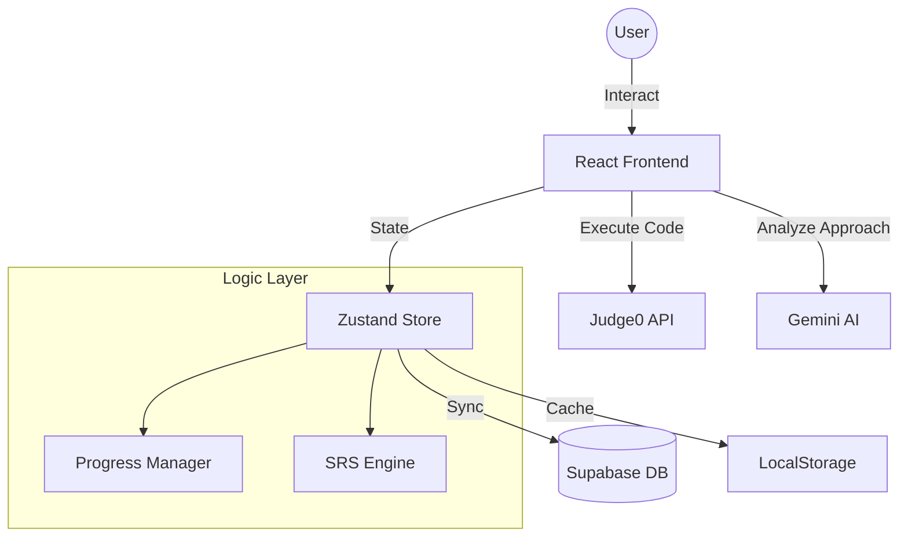

# PatternLab AI 🧪

PatternLab is a premium, AI-powered Data Structures and Algorithms (DSA) learning platform designed to bridge the gap between solving problems and mastering underlying algorithmic patterns. It combines an advanced coding environment with real-time AI guidance, interactive visualization, and a robust spaced-repetition system.


## 🚀 Key Features

### 1. 🧠 AI-Enhanced Learning
- **Contextual Chat**: Ask questions about any DSA topic. The AI understands your current problem and provides optimal approaches, dry runs, and time complexity analysis.
- **AI Review**: Submit your code for an instant, deep-dive review. Get line-by-line annotations, optimization suggestions, and "Better Approach" hints.

### 2. 💻 Pro IDE Experience
- **Multi-Language Support**: Write solutions in Python, Java, C++, JavaScript, Go, and Rust.
- **Real-time Feedback**: Integrated with Judge0 API for instant test case validation.
- **Smart Hints**: Progressively revealed hints to help you solve without giving away the answer too early.

### 3. 📊 Mastery & Progression
- **Topic-Wise Tracking**: Complete curated paths like Arrays, Strings, Trees, and Dynamic Programming.
- **Pattern-Aware Stats**: Go beyond just "solved" counts. Track your mastery of specific patterns like *Sliding Window*, *Two Pointers*, or *Backtracking*.
- **Activity Heatmap**: Visualize your daily consistency and maintain your solving streak.

### 4. 🔔 Spaced Repetition (Reminders)
- **Automatic Scheduling**: Every problem you solve is added to a revision queue.
- **Spaced Intervals**: Re-solve problems after 3 days, 1 week, and 1 month to ensure long-term retention.
- **Weekend Mode**: Busy during the week? Batch all your revisions for the weekend automatically.

### 5. 📉 Algorithm Visualizer
- **Dry Run Support**: Visualize complex algorithms (Sorting, Trees, Graphs) as they execute.
- **Interactive States**: Step through code and watch the data structures change in real-time.

---

## 🏗️ Architecture & System Design

PatternLab is built with a modern, reactive stack designed for high performance and low latency.

### Tech Stack
- **Frontend**: React 19 + TypeScript + Vite
- **Styling**: Tailwind CSS + Framer Motion (for fluid animations)
- **State Management**: Zustand (Store-based state with persistent LocalStorage/Supabase sync)
- **AI Engine**: Google Gemini AI (via `@google/generative-ai`)
- **Code Execution**: Judge0 API (via RapidAPI)
- **Database/Auth**: Supabase (PostgreSQL)
- **Icons**: Lucide React

### System Diagram


---

## 🛠️ Installation & Setup

### Prerequisites
- Node.js (v18+)
- npm or yarn
- RapidAPI Key (for Judge0)
- Google Gemini API Key

### Getting Started
1. **Clone the repository**:
   ```bash
   git clone https://github.com/jiyajahnavi/PatternLab-AI.git
   cd PatternLab
   ```

2. **Install dependencies**:
   ```bash
   npm install
   ```

3. **Configure Environment Variables**:
   Create a `.env` file in the root directory:
   ```env
   VITE_SUPABASE_URL=your_supabase_url
   VITE_SUPABASE_ANON_KEY=your_supabase_key
   VITE_GEMINI_API_KEY=your_gemini_key
   VITE_RAPIDAPI_KEY=your_judge0_key
   ```

4. **Run development server**:
   ```bash
   npm run dev
   ```

---

## 📖 How It Works

### The Solving Loop
1. **Topic Selection**: Choose a topic from the Progress Hub.
2. **Implementation**: Solve the problem in the IDE. Use the "AI Hint" if you get stuck.
3. **Execution**: Run your code against built-in test cases.
4. **Review**: After success, trigger an AI Review to see how an expert would optimize your code.
5. **Retention**: The problem is automatically added to your **Reminder Hub**.

### Spaced Repetition (SRS)
The system uses the **Leitner System** logic:
- **Interval 1**: 3 days after solve.
- **Interval 2**: 7 days after solve.
- **Interval 3**: 30 days after solve.
The goal is to move every problem into the "Mastered" state.

---

## 🤝 Contributing
Contributions are welcome! Please follow these steps:
1. Fork the Project.
2. Create your Feature Branch (`git checkout -b feature/AmazingFeature`).
3. Commit your Changes (`git commit -m 'Add some AmazingFeature'`).
4. Push to the Branch (`git push origin feature/AmazingFeature`).
5. Open a Pull Request.

---

## 📄 License
Distributed under the MIT License. See `LICENSE` for more information.

