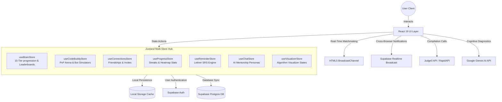
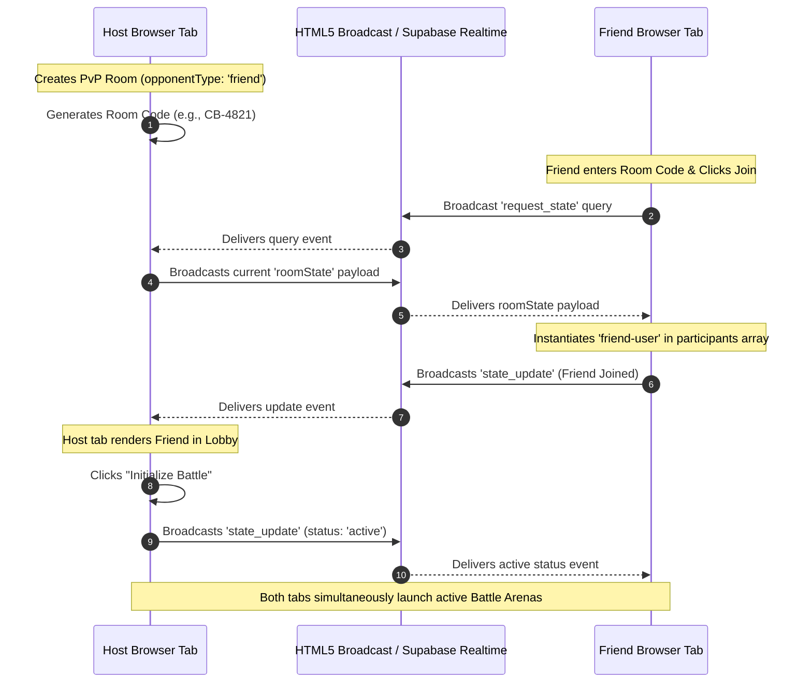
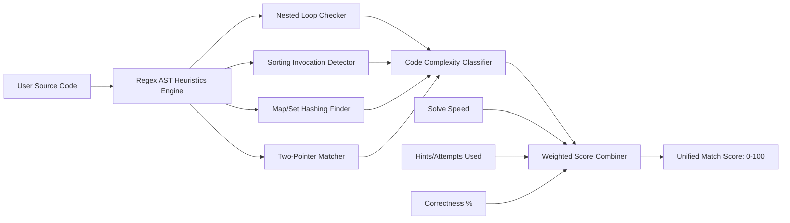

# PatternLab AI 🧪

PatternLab is a premium, gamified, AI-powered Data Structures and Algorithms (DSA) learning platform designed to bridge the gap between solving problems and mastering underlying algorithmic patterns. It integrates a professional IDE with real-time AI guidance, interactive algorithmic visualization, a Leitner-based spaced-repetition scheduler, and an advanced multiplayer **CodeBuddy PvP Battle Arena** featuring socketless real-time synchronization.


---

## 🛠️ Technology Stack & Badges

PatternLab is built with a modern, high-performance reactive stack engineered for sub-second synchronization and ultra-low latency.


---

## 🏗️ Platform System Architecture

PatternLab uses a distributed store-driven client architecture. Zustand coordinates frontend application state, persisting locally to `LocalStorage` and broadcasting in real-time across tabs/windows using a hybrid protocol of standard HTML5 `BroadcastChannel` APIs and Supabase Realtime networks.



---

## 🚀 Key Architectural Features

### 1. 🧠 DSA Brain & Progression System
The core engine gamifies the student's problem-solving process by compiling a comprehensive metric rating system (overall skill score, percentile rank, code quality, optimization rating, debugging index, and solving consistency) mapped to a **15-Tier progression ladder**:

| Tier | Range (Rating) | Badge Icon | CSS Theme Class |
| :--- | :--- | :--- | :--- |
| **Apex** | `1867 - 2000` | 🏆 | `text-yellow-300` |
| **Mythic** | `1734 - 1866` | 🌌 | `text-fuchsia-400` |
| **Legend** | `1601 - 1733` | 🔥 | `text-red-400` |
| **Grandmaster** | `1467 - 1600` | 👑 | `text-rose-400` |
| **Elite** | `1334 - 1466` | ⚡ | `text-orange-400` |
| **Master** | `1201 - 1333` | 🌟 | `text-amber-400` |
| **Expert** | `1067 - 1200` | 🏅 | `text-purple-400` |
| **Pro** | `934 - 1066` | 💎 | `text-violet-400` |
| **Advanced** | `801 - 933` | 🚀 | `text-indigo-400` |
| **Skilled** | `667 - 800` | ⚙️ | `text-blue-400` |
| **Solver** | `534 - 666` | 🧩 | `text-cyan-400` |
| **Explorer** | `401 - 533` | 🧭 | `text-teal-400` |
| **Learner** | `267 - 400` | 📚 | `text-green-400` |
| **Rookie** | `134 - 266` | 🔰 | `text-zinc-400` |
| **Beginner** | `0 - 133` | 🌱 | `text-slate-400` |

- **Jump-to-IDE History integration**: Click on any historical session card on the dashboard to immediately reconstruct the exact problem workspace, including your previous code submissions and compiler review reports.
- **Adaptive AI Questions**: Adaptive DSA problem generation dynamically calibrates question constraints based on the user's current rating and weakest structural tags.

### 2. ⚔️ CodeBuddy PvP Battle Arena
A massive real-time gamified playground where users can test their DSA capabilities side-by-side:
- **Bot Companions**: Challenge customized AI engines including **Jerry** (O(N) HashMap focus), **Devbot** (highly optimized two-pointer focus), and **Coder-X** (brute-force focus).
- **Friend Multiplayer Mode**: Host/Join custom lobbies by exchanging unique copyable match codes.
- **Lobby Synchronization**: Waiting screens dynamically register connected participants, enabling standard players to seamlessly engage in multiplayer challenges.
- **Live Status Feed**: Active coding HUD panels transmit real-time states (*Coding*, *Submitting*, *Submitted*, *Hints Used*, and *Attempts*) to the opponent's tab.

### 3. 👥 Networking & Connections Hub
A competitive coding social network allowing students to interact, track, and challenge other developers:
- **Custom Invite links**: Users configure a unique username slug to generate shareable links (`patternlab.ai/connect/username`).
- **Interactive Connect Page**: Invitees open connection cards detailing the inviter's tier badges, overall points, strongest topic tags, and streaks, with a glowing **"Connect on CodeBuddy"** button.
- **Social Feed & Presence**: Tracks active developer status (Online/Offline) and achievements dynamically (e.g. *"Jerry solved Two Sum using an optimal Two-Pointer sweep! 🚀"*).
- **Privacy Dashboard**: Allows users to selectively toggle profile visibility, activity feed broadcasts, profile comparison permissions, PvP battle invite allowance, and online presence status.

### 4. 📊 Side-by-Side Profile Comparer
A dual-metric visual comparison console comparing 15 distinct developer capabilities:
- **Relative Comparison Meters**: Sleek visual bars display relative metric differentials between the user and any connection, awarding a gold crown badge (`👑`) to the metric leader.
- **Gemini AI Analysis**: Integrates deep-dive cognitive diagnostics comparing the developers' structural architectures, time/space complexities, and debugging speeds. If no Gemini API Key is configured, the engine defaults to a robust deterministic engineering compiler to provide detailed insights immediately.

### 5. 🎨 Profile Avatar Customization Studio
Allows students to craft premium avatars representational of their competitive developer identities:
- **Presetted Avatars**: Curated, beautifully stylized character illustrations.
- **Avatar Studio (Ghibli Mode)**: A dynamic SVG-drawing engine allowing students to configure custom Ghibli-inspired details (skin tones, hair styles, clothing, eyewear, accessories, and colors) compiled on the fly.
- **Generative AI Art Studio**: Employs generative models allowing users to type prompts (e.g., *"Cyberpunk hacker wearing glowing VR visor"*), generating a custom 3D cyberpunk avatar directly onto their profile.

---

## 📡 Under the Hood: Zero-Socket Real-Time Sync

A key engineering marvel of PatternLab is its **Zero-Socket Cross-Tab Sync Protocol**. Standard multiplayer web setups require running costly, heavy WebSocket servers (e.g. Socket.io, WebRTC) that incur massive latency and infrastructure bills. PatternLab resolves this by orchestrating a hybrid client-side sync network.

### Real-Time Cross-Tab PvP Sync Protocol
When both players are on the same browser (different tabs/windows), PatternLab utilizes a high-efficiency HTML5 `BroadcastChannel` and `storage` event pipeline. When playing across different machines/locations, it gracefully falls back to Supabase Realtime broadcast channels.



---

## 🧮 Solution Scoring Engine

PatternLab computes a multi-faceted weighted score for each submission, combining standard correctness metrics with raw code optimization indexes.

### Code Heuristic Parser (AST-Like Analysis)
Before compiling the score, PatternLab runs a deterministic, regex-based heuristic analysis on the submitted source code to identify complexity characteristics (bypassing comment blocks and spacing anomalies):

1. **Nested Loops Check (`O(N²)` Trigger)**:
   - Scans indentation nesting structures (Python) and curly-brace scopes (C++, Java, JS) to detect multi-layered loop nesting.
2. **Sorting Calls (`O(N log N)` Trigger)**:
   - Identifies functions containing `.sort()`, `sorted()`, `sort<`, etc.
3. **HashMap/HashSet Indexes (`O(N)` Time / `O(N)` Space Trigger)**:
   - Scans for structural instantiations (`Map()`, `Set()`, `dict()`, `unordered_map`, `lookup`) indicating space-complexity-for-speed trade-offs.
4. **Two-Pointer Operations (`O(N)` Time / `O(1)` Space Trigger)**:
   - Recognizes index traversal markers (`while left < right`, `start < end`, `low < high`).

### The Battle Score Equation
The final unified score is calculated by combining multiple performance metrics:

$$\text{Final Score} = (\text{Correctness} \times 0.40) + (\text{Complexity Index} \times 0.25) + (\text{Speed Index} \times 0.15) + (\text{Code Quality} \times 0.10) + (\text{Hint Index} \times 0.10)$$



---

## 🛠️ Installation & Environment Configuration

### Prerequisites
- **Node.js** (v18.0 or higher)
- **npm** or **yarn** package manager
- **Supabase Account** (Postgres DB, Broadcast Realtime, and Authentication)
- **Google Gemini API Key** (for AI Mentor personas and Profile Comparers)
- **RapidAPI / Judge0 Key** (for remote multi-language code compilation)

### Getting Started

1. **Clone the repository**:
   ```bash
   git clone https://github.com/jiyajahnavi/PatternLab-AI.git
   cd PatternLab
   ```

2. **Install dependencies**:
   ```bash
   npm install
   ```

3. **Configure Environment Variables**:
   Create a `.env` file in the project root directory and feed it your custom API keys:
   ```env
   VITE_SUPABASE_URL=your_supabase_project_url
   VITE_SUPABASE_ANON_KEY=your_supabase_anon_key
   VITE_GEMINI_API_KEY=your_google_gemini_api_key
   VITE_RAPIDAPI_KEY=your_rapidapi_judge0_key
   ```

4. **Initialize Local/Supabase Database**:
   Set up your PostgreSQL database using the provided seeding script:
   ```bash
   psql -U your_postgres_user -d your_database_name -f seed.sql
   ```

5. **Start the Development Server**:
   ```bash
   npm run dev
   ```

---

## 📄 License
Distributed under the MIT License. See `LICENSE` for more information.

---

*Handcrafted with passion for algorithmic excellence. Build. Battle. Master. 🚀*
