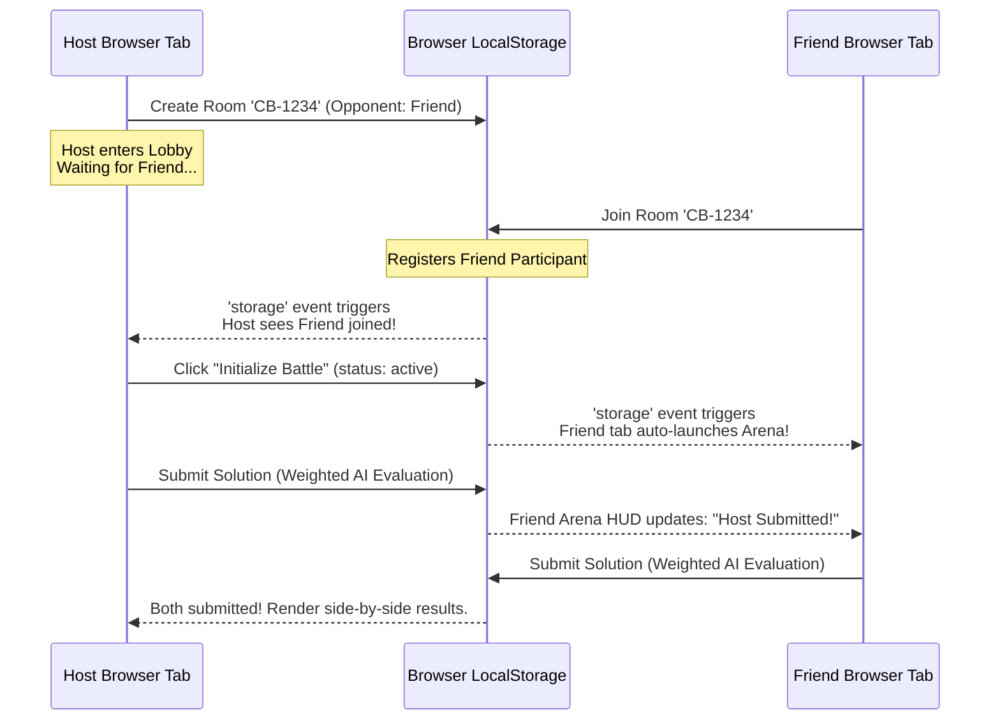

# Implementation Plan - CodeBuddy Cross-Tab Multiplayer Sync

We will extend CodeBuddy to support a fully operational **Friend-vs-Friend Match** mode. By leveraging high-fidelity browser `storage` event synchronization, we can achieve real-time multiplayer states across distinct browser tabs/windows without needing a dedicated backend socket server!

## Proposed Architecture & Sync Design

### 1. Unified Real-Time Sync Store

#### [MODIFY] [useCodeBuddyStore.ts](file:///Users/jiyajahnavi/Documents/WebDev/PatternLab/src/store/useCodeBuddyStore.ts)
- **State changes**:
  - `opponentType`: `'bot' | 'friend'`
  - `myParticipantId`: `'host-user' | 'friend-user'`
- **Actions & Operations**:
  - `createRoom(settings)`:
    - If setting `opponentType === 'friend'`:
      - Initialize room with host only.
      - Save state to `localStorage` under `patternlab_cb_room_${code}`.
    - If `opponentType === 'bot'`: behaves as before (spawns bot jerry/devbot/coder-x).
  - `joinRoom(code)`:
    - Look up `patternlab_cb_room_${code}` in `localStorage`.
    - If found:
      - Register friend participant: `{ id: 'friend-user', name: 'Challenger (Friend)', ... }`.
      - Save updated state to `localStorage`.
      - Set `myParticipantId: 'friend-user'`.
  - `syncFromStorage(roomState)`:
    - Utility to force-feed raw updates received from cross-tab events into the local Zustand store.
  - `updateParticipantState(updates)`:
    - Throttled action to update the user's specific participant details (code, status, solve metrics) and sync to `localStorage` for cross-tab transmission.

### 2. Live Tab Event Listener Hooks

#### [NEW] [useCodeBuddySync.ts](file:///Users/jiyajahnavi/Documents/WebDev/PatternLab/src/hooks/useCodeBuddySync.ts)
We will introduce a React Hook that manages live cross-tab subscriptions while in the lobby or active match:
- Listens to `'storage'` events globally.
- When an update matches `patternlab_cb_room_${activeRoomCode}`, it parses the updated state and updates the Zustand store.
- Listens to window unload events to automatically mark participants as "Disconnected" or "Left Match".

### 3. Lobby UI Enhancements

#### [MODIFY] [CodeBuddyPage.tsx](file:///Users/jiyajahnavi/Documents/WebDev/PatternLab/src/pages/CodeBuddyPage.tsx)
- **Create battle controls**:
  - Toggle between **"Challenge Bot Companion"** and **"Invite a Friend (Multiplayer)"**.
  - If "Invite a Friend" is active:
    - Hide bot selectors.
    - Show helper overlay: *"Invite link code is copyable. Share it with a friend who can open PatternLab in another tab or device to battle!"*
- **Waiting Lobby wait-state**:
  - If Host: Shows "Initialize Battle Arena" button. If friend has not joined, the button remains disabled: *"Waiting for friend to connect..."*
  - If Friend: Shows a glowing loading ring: *"Connected! Waiting for host to initiate the battle arena..."*

### 4. Live Coding Arena Updates

#### [MODIFY] [CodeBuddyArena.tsx](file:///Users/jiyajahnavi/Documents/WebDev/PatternLab/src/components/codebuddy/CodeBuddyArena.tsx)
- Keep opponent cards updated dynamically:
  - If `opponentType === 'friend'`, render friend participant name/avatar and active submission state in the HUD.
  - Throttled sync allows both tabs to see if the other is actively typing or submitted, creating a massive gaming battle atmosphere!

---

## Verification Plan

### Automated Verification
- Verify build compiler success using `npm run build`.

### Manual Cross-Tab Verification
1. Open a browser window to `http://localhost:5173/codebuddy` and choose "Invite a Friend" battle setup.
2. Generate Room Code (e.g. `CB-5832`).
3. Open a **second tab / incognito window** to `http://localhost:5173/codebuddy` and enter room code `CB-5832`.
4. Confirm both tabs sync instantly: Host sees Friend join, Friend wait screen says *"Waiting for host to start..."*
5. Click "Initialize Battle" in Host tab, confirm both tabs auto-route to active coding arenas.
6. Type solutions in both editors and verify completions declare the accurate winner side-by-side!
