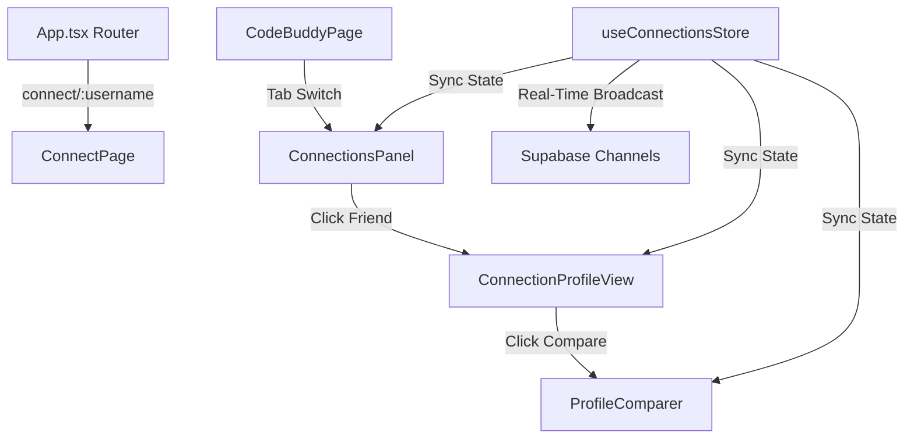

# Implementation Plan - CodeBuddy Connections & Profile Comparison

I will implement the **Connections System & Profile Comparison** as a seamless, high-fidelity add-on inside **CodeBuddy**. The system will feel like a skill-focused, competitive coding social layer (think GitHub + LeetCode + AI Mentor), complete with real-time status syncing, invite links, a side-by-side comparative dashboard, and deep AI-powered intelligence.

---

## User Review Required

> [!IMPORTANT]
> - **Zero Backend Setup Required**: I will build a highly resilient Zustand store (`useConnectionsStore.ts`) that persists everything to local storage. It will also use Supabase broadcast channels for real-time multiplayer notification syncing.
> - **Lively Demo Data**: To provide a stunning first impression, the store will automatically seed 4 active connections (Tom, Jerry, Alice, Bob) and 3 pending requests if no prior state is saved. This allows immediate testing of profile previews, accepts, rejects, side-by-side comparison, and AI insights.
> - **API Key Fallback**: The AI Comparison engine will query the Gemini API if a user key is configured in settings or `.env`. Otherwise, it uses a deterministic engineering-focused comparison compiler to generate highly personalized bullet points based on real stat differences. This ensures perfect reliability in all environments.

---

## Proposed Changes

I will introduce 5 new components/stores and modify 3 existing files:

### 1. State Management Layer

#### [NEW] [useConnectionsStore.ts](file:///Users/jiyajahnavi/Documents/WebDev/PatternLab/src/store/useConnectionsStore.ts)
A specialized store for the social coding layer.
- **State Properties**:
  - `connections`: Active connections list with stats (avatar, points, rank, strongest topic, etc.).
  - `pendingRequests`: Incoming connection requests with display name, points, and rank.
  - `sentRequests`: Outgoing connection requests.
  - `activityFeed`: Dynamic list of recent achievements of friends.
  - `privacySettings`: Settings (Profile visibility, Activity feed, Compare permissions, PVP battle invites, Online status).
  - `inviteUsername`: Unique slug generated from user email/display name (e.g. `jahnavi123`).
- **Actions**:
  - `acceptRequest(id)` / `rejectRequest(id)`: Handle pending requests.
  - `sendRequest(username)`: Dispatch an outgoing connection request.
  - `generateInviteLink()`: Compiles the local/production URL.
  - `challengeFriend(friendUsername)`: Programmatically creates an arena room and auto-triggers a battle invitation.
  - `updatePrivacySettings(settings)`: Toggle privacy options.
  - `seedMockData()`: Populate initial premium coding profiles for rich testing.

### 2. Page & Router Setup

#### [NEW] [ConnectPage.tsx](file:///Users/jiyajahnavi/Documents/WebDev/PatternLab/src/pages/ConnectPage.tsx)
The landing page when a user opens an invite link (`patternlab.ai/connect/username`).
- Shows a premium glassmorphic preview card of the sender's profile stats (tier badge, total points, streaks, strongest topic, and solved problems).
- A giant glowing button: **"Connect on CodeBuddy"** with interactive active-state changes and a success animation.
- Triggers a real-time request event back to the sender.

#### [MODIFY] [App.tsx](file:///Users/jiyajahnavi/Documents/WebDev/PatternLab/src/App.tsx)
Register the public route:
- Add `<Route path="connect/:username" element={<ConnectPage />} />` under the authenticated or layout routes to display the profile card.

### 3. UI Components (CodeBuddy Integration)

#### [MODIFY] [CodeBuddyPage.tsx](file:///Users/jiyajahnavi/Documents/WebDev/PatternLab/src/pages/CodeBuddyPage.tsx)
- Add a top sub-navigation tab selector in the lobby state (`!room`) to switch between:
  1. `🎮 PVP Arena` (The original private lobby and bot challenges)
  2. `👥 Connections` (The new developer connections panel)
- Renders the new `<ConnectionsPanel />` when selected.

#### [NEW] [ConnectionsPanel.tsx](file:///Users/jiyajahnavi/Documents/WebDev/PatternLab/src/components/codebuddy/ConnectionsPanel.tsx)
The main hub for developer connections. Includes:
- **Invite Friend Widget**: Beautiful box with copyable invite link, glowing share button, and clipboard feedback.
- **Pending Requests Sidebar**: Real-time list of requests with glowing Accept (emerald check) and Reject (rose-red x) buttons.
- **Connections Grid**: Clean grid showing profile avatars, username, online/offline presence indicator, points, rank, strongest topic, and options: **"View Profile"**, **"Compare"**, and **"Challenge"**.
- **Engineering Activity Feed**: A list of clean, engineering-focused events of friends.
- **Privacy Controls**: A clean toggle panel.

#### [NEW] [ConnectionProfileView.tsx](file:///Users/jiyajahnavi/Documents/WebDev/PatternLab/src/components/codebuddy/ConnectionProfileView.tsx)
Full-screen sub-view for viewing a connection's profile.
- Replicates the normal user profile page styling (topic mastery, pattern mastery, streaks, stats, AI ratings, heatmap, solved problems, optimization rating).
- Top interactive headers with large, glowing action buttons:
  - **"Challenge to PVP Battle"**: Creates a room and invites them.
  - **"Compare Profiles"**: Launches side-by-side stats comparison!

#### [NEW] [ProfileComparer.tsx](file:///Users/jiyajahnavi/Documents/WebDev/PatternLab/src/components/codebuddy/ProfileComparer.tsx)
Side-by-side comparative dashboard comparing 15 developer metrics:
- Metrics compared: Total solved, topic mastery, strongest/weakest topics, average complexity, solve speed, CodeBuddy points, AI optimization rating, streaks, ranking percentile, debugging efficiency, hint dependency, and hardest solved.
- **Visual Meters**: Sleek horizontal progress comparison bars showing who is leading in each metric with a gold crown badge.
- **AI Comparison Analysis**: Queries Gemini (using settings or env key fallback) or runs a smart deterministic compiler to yield 4 high-value engineering comparative bullet insights.

---

## Verification Plan

### Automated Tests
- Run `npm run build` to verify there are no compilation or TypeScript errors.

### Manual Verification
1. **Lobby Toggle**: Verify the user can switch smoothly between the Arena and Connections views.
2. **Demo Seeding**: Confirm that on first load, active mock connections (Tom, Jerry, Alice, Bob), pending requests, and achievements populate correctly.
3. **Accept / Reject Request**: Confirm clicking "Accept" adds the user to the active connections list, updates their online presence, and triggers a success transition.
4. **View Profile**: Verify that clicking a connection displays their complete profile stats (streaks, heatmap, etc.) matching the normal profile experience.
5. **Direct Battle Invite**: Confirm clicking "Challenge" creates a multiplayer battle lobby under the friend challenger mode.
6. **Side-by-Side Comparison**: Verify all 15 metrics are listed, the horizontal meters accurately align with the relative values, and the winner is badged.
7. **AI Analysis Generation**: Toggle settings to test with and without API keys. Ensure the AI Comparison card provides rich, smart, personalized engineering bullets.
